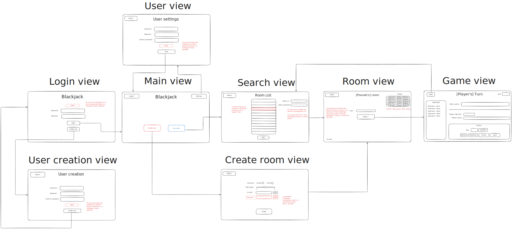
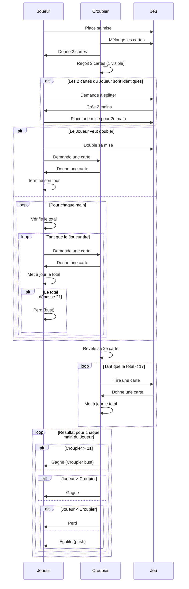

# Blackjack FX

Thème : Le but, est de créer une application lourde autour du thème du blackjack la plus fidèle possible.

> !Lien du répos distant : [Github](https://github.com/Blackjack-Project/Blackjack-FX.git)

## Prérequis pour utiliser le projet

Pour lancer le projet il est nécéssaire d'accéder à la base.

## Diagramme des cas d'utilisation

## Diagramme de classe : Architecture MVVM + Domaine

## Maquette interface

## MCD

## Base de données

## Diagramme de séquence

