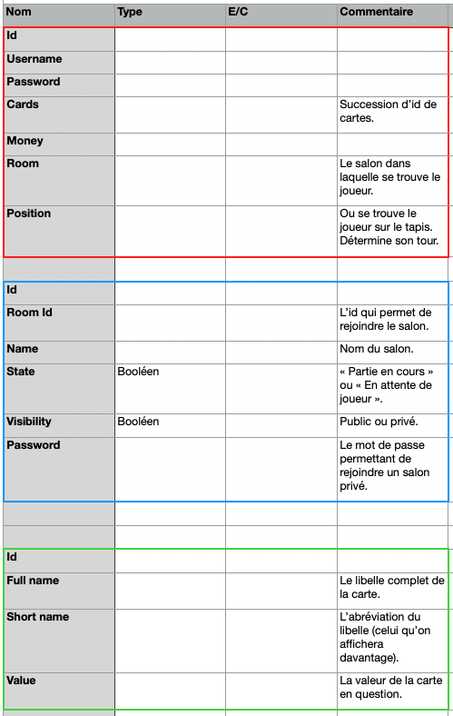
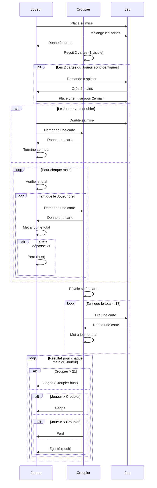

# Blackjack FX

Thème : Le but, est de créer une application lourde autour du thème du blackjack la plus fidèle possible.

> Lien du répos distant : [Github](https://github.com/Blackjack-Project/Blackjack-FX.git)

## Prérequis pour utiliser le projet

Pour lancer le projet il est nécéssaire d'accéder à la base.

## Diagramme des cas d'utilisation


## Diagramme de classe : Architecture MVVM + Domaine


## Maquette interface


## MCD

 [mcd.xlsx](assets/mcd.xlsx) 



## Base de données

 [database.sql](assets/database.sql) 

```sql
CREATE DATABASE  IF NOT EXISTS `blackjack` /*!40100 DEFAULT CHARACTER SET utf8mb4 COLLATE utf8mb4_0900_ai_ci */ /*!80016 DEFAULT ENCRYPTION='N' */;
USE `blackjack`;
-- MySQL dump 10.13  Distrib 8.0.34, for Win64 (x86_64)
--
-- Host: localhost    Database: blackjack
-- ------------------------------------------------------
-- Server version	8.0.35

/*!40101 SET @OLD_CHARACTER_SET_CLIENT=@@CHARACTER_SET_CLIENT */;
/*!40101 SET @OLD_CHARACTER_SET_RESULTS=@@CHARACTER_SET_RESULTS */;
/*!40101 SET @OLD_COLLATION_CONNECTION=@@COLLATION_CONNECTION */;
/*!50503 SET NAMES utf8 */;
/*!40103 SET @OLD_TIME_ZONE=@@TIME_ZONE */;
/*!40103 SET TIME_ZONE='+00:00' */;
/*!40014 SET @OLD_UNIQUE_CHECKS=@@UNIQUE_CHECKS, UNIQUE_CHECKS=0 */;
/*!40014 SET @OLD_FOREIGN_KEY_CHECKS=@@FOREIGN_KEY_CHECKS, FOREIGN_KEY_CHECKS=0 */;
/*!40101 SET @OLD_SQL_MODE=@@SQL_MODE, SQL_MODE='NO_AUTO_VALUE_ON_ZERO' */;
/*!40111 SET @OLD_SQL_NOTES=@@SQL_NOTES, SQL_NOTES=0 */;

--
-- Table structure for table `card`
--

DROP TABLE IF EXISTS `card`;
/*!40101 SET @saved_cs_client     = @@character_set_client */;
/*!50503 SET character_set_client = utf8mb4 */;
CREATE TABLE `card` (
  `id` int NOT NULL AUTO_INCREMENT,
  `full_name` varchar(45) NOT NULL,
  `short_name` varchar(45) NOT NULL,
  `value` int NOT NULL,
  PRIMARY KEY (`id`)
) ENGINE=InnoDB AUTO_INCREMENT=53 DEFAULT CHARSET=utf8mb4 COLLATE=utf8mb4_0900_ai_ci;
/*!40101 SET character_set_client = @saved_cs_client */;

--
-- Dumping data for table `card`
--

LOCK TABLES `card` WRITE;
/*!40000 ALTER TABLE `card` DISABLE KEYS */;
INSERT INTO `card` VALUES (1,'Two of Spade','2♠',2),(2,'Three of Spade','3♠',3),(3,'Four of Spade','4♠',4),(4,'Five of Spade','5♠',5),(5,'Six of Spade','6♠',6),(6,'Seven of Spade','7♠',7),(7,'Eight of Spade','8♠',8),(8,'Nine of Spade','9♠',9),(9,'Ten of Spade','10♠',10),(10,'Jack of Spade','J♠',10),(11,'Queen of Spade','Q♠',10),(12,'King of Spade','K♠',10),(13,'Ace of Spade','A♠',11),(14,'Two of Heart','2♥',2),(15,'Three of Heart','3♥',3),(16,'Four of Heart','4♥',4),(17,'Five of Heart','5♥',5),(18,'Six of Heart','6♥',6),(19,'Seven of Heart','7♥',7),(20,'Eight of Heart','8♥',8),(21,'Nine of Heart','9♥',9),(22,'Ten of Heart','10♥',10),(23,'Jack of Heart','J♥',10),(24,'Queen of Heart','Q♥',10),(25,'King of Heart','K♥',10),(26,'Ace of Heart','A♥',11),(27,'Two of Club','2♣',2),(28,'Three of Club','3♣',3),(29,'Four of Club','4♣',4),(30,'Five of Club','5♣',5),(31,'Six of Club','6♣',6),(32,'Seven of Club','7♣',7),(33,'Eight of Club','8♣',8),(34,'Nine of Club','9♣',9),(35,'Ten of Club','10♣',10),(36,'Jack of Club','J♣',10),(37,'Queen of Club','Q♣',10),(38,'King of Club','K♣',10),(39,'Ace of Club','A♣',11),(40,'Two of Diamond','2♦',2),(41,'Three of Diamond','3♦',3),(42,'Four of Diamond','4♦',4),(43,'Five of Diamond','5♦',5),(44,'Six of Diamond','6♦',6),(45,'Seven of Diamond','7♦',7),(46,'Eight of Diamond','8♦',8),(47,'Nine of Diamond','9♦',9),(48,'Ten of Diamond','10♦',10),(49,'Jack of Diamond','J♦',10),(50,'Queen of Diamond','Q♦',10),(51,'King of Diamond','K♦',10),(52,'Ace of Diamond','A♦',11);
/*!40000 ALTER TABLE `card` ENABLE KEYS */;
UNLOCK TABLES;

--
-- Table structure for table `player`
--

DROP TABLE IF EXISTS `player`;
/*!40101 SET @saved_cs_client     = @@character_set_client */;
/*!50503 SET character_set_client = utf8mb4 */;
CREATE TABLE `player` (
  `id` int NOT NULL AUTO_INCREMENT,
  `username` varchar(45) NOT NULL,
  `password` varchar(45) NOT NULL,
  `role` tinyint NOT NULL DEFAULT '0',
  `cards` varchar(150) DEFAULT NULL,
  `money` int NOT NULL DEFAULT '0',
  `room` int DEFAULT NULL,
  `position` int DEFAULT NULL,
  PRIMARY KEY (`id`),
  KEY `player_room_idx` (`room`),
  CONSTRAINT `player_room` FOREIGN KEY (`room`) REFERENCES `room` (`id`)
) ENGINE=InnoDB DEFAULT CHARSET=utf8mb4 COLLATE=utf8mb4_0900_ai_ci;
/*!40101 SET character_set_client = @saved_cs_client */;

--
-- Dumping data for table `player`
--

LOCK TABLES `player` WRITE;
/*!40000 ALTER TABLE `player` DISABLE KEYS */;
/*!40000 ALTER TABLE `player` ENABLE KEYS */;
UNLOCK TABLES;

--
-- Table structure for table `room`
--

DROP TABLE IF EXISTS `room`;
/*!40101 SET @saved_cs_client     = @@character_set_client */;
/*!50503 SET character_set_client = utf8mb4 */;
CREATE TABLE `room` (
  `id` int NOT NULL AUTO_INCREMENT,
  `roomid` int NOT NULL,
  `name` varchar(45) NOT NULL,
  `state` tinyint NOT NULL DEFAULT '1',
  `visibility` tinyint NOT NULL DEFAULT '1',
  `password` varchar(45) DEFAULT NULL,
  PRIMARY KEY (`id`)
) ENGINE=InnoDB DEFAULT CHARSET=utf8mb4 COLLATE=utf8mb4_0900_ai_ci;
/*!40101 SET character_set_client = @saved_cs_client */;

--
-- Dumping data for table `room`
--

LOCK TABLES `room` WRITE;
/*!40000 ALTER TABLE `room` DISABLE KEYS */;
/*!40000 ALTER TABLE `room` ENABLE KEYS */;
UNLOCK TABLES;
/*!40103 SET TIME_ZONE=@OLD_TIME_ZONE */;

/*!40101 SET SQL_MODE=@OLD_SQL_MODE */;
/*!40014 SET FOREIGN_KEY_CHECKS=@OLD_FOREIGN_KEY_CHECKS */;
/*!40014 SET UNIQUE_CHECKS=@OLD_UNIQUE_CHECKS */;
/*!40101 SET CHARACTER_SET_CLIENT=@OLD_CHARACTER_SET_CLIENT */;
/*!40101 SET CHARACTER_SET_RESULTS=@OLD_CHARACTER_SET_RESULTS */;
/*!40101 SET COLLATION_CONNECTION=@OLD_COLLATION_CONNECTION */;
/*!40111 SET SQL_NOTES=@OLD_SQL_NOTES */;

-- Dump completed on 2025-04-16 14:02:46

```


## Diagramme de séquence



